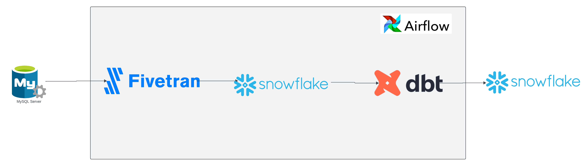
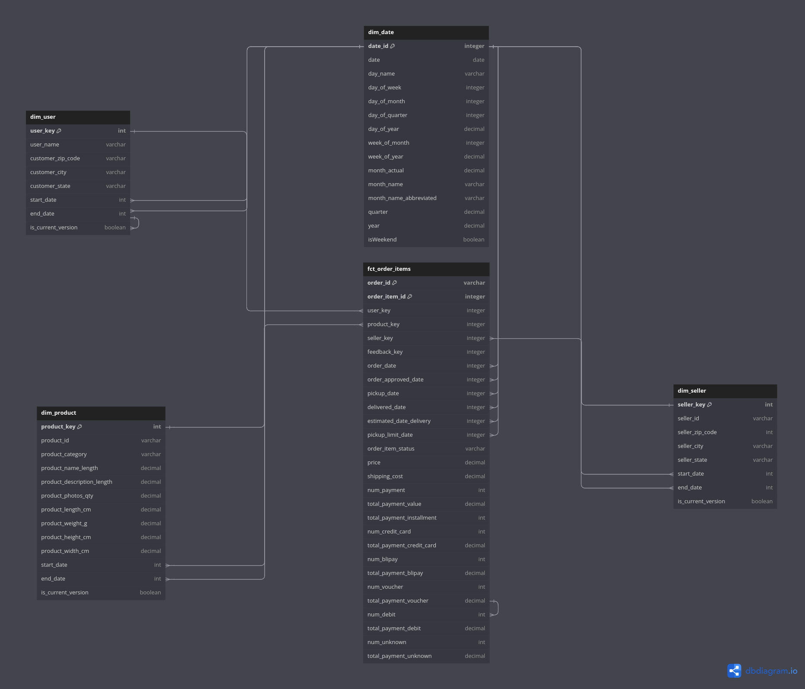

    
    <h2 align="center">Ecommerce Analytics</h2>
    

   
    

 

A end to end ELT data engineering project using fivetran,dbt,snowflake, and airflow. </b>

## Overview

This project establishes a robust, automated data pipeline that refreshes weekly.

Here's a breakdown of the key components:

- Orchestration: Apache Airflow acts as the central scheduler, triggering the pipeline execution on a weekly basis.    
- Data Extraction: Fivetran is employed to extract data from various sources. It streamlines data retrieval, ensuring a reliable and efficient process.     
- Data Storage: The extracted data is securely stored in Snowflake, a cloud-based data warehouse. Snowflake offers scalability and performance for housing large datasets.     
- Data Transformation: Upon successful data extraction, Airflow triggers a dbt (data build tool) job. This job performs the final transformations on the data, preparing it for analysis and consumption.     

## Data Model 

